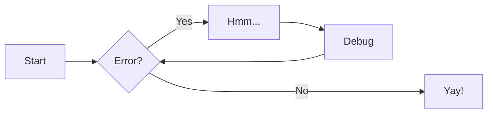

# Test2

## 検索テスト

検索のテストです。

| param | name              | type   |
| :---- | :---------------- | :----- |
| path  | `{customer_code}` | string |
| body  | `.customer_name`  | string |
| body  | `.hoge[].hoge1`   | string |

## コードハイライトのテスト

```java
public class HelloWorld{
    public static void main(String[] args){
        System.out.println("Hello World!!");
    }
}
```

## PlantUML のテスト

```plantuml
Bob->Alice : hello
```

## アラート装飾のテスト

!!! note
    これはノートです。

    * aaa
    * bbb

    | aaa
    | :---
    | hoge

    ```java
    public class HelloWorld{
        public static void main(String[] args){
            System.out.println("Hello World!!");
        }
    }
    ```

!!! note
    `note`, `seealso` ラベルで使用できる装飾です。

!!! abstract
    `abstract`, `summary`, `tldr` ラベルで使用できる装飾です。

!!! info
    `info`, `todo` ラベルで使用できる装飾です。

!!! tip
    `tip`, `hint`, `important` ラベルで使用できる装飾です。

!!! success
    `success`, `check`, `done` ラベルで使用できる装飾です。

!!! question
    `question`, `help`, `faq` ラベルで使用できる装飾です。

!!! warning
    `warning`, `caution`, `attention` ラベルで使用できる装飾です。

!!! failure
    `failure`, `fail`, `missing` ラベルで使用できる装飾です。

!!! danger
    `danger`, `error` ラベルで使用できる装飾です。

!!! bug
    `bug` ラベルで使用できる装飾です。

!!! example
    `example` ラベルで使用できる装飾です。

!!! quote
    `quote`, `cite` ラベルで使用できる装飾です。

## コンテンツの折りたたみテスト

??? note
    これはノートです。

    ??? note "ネストされた詳細 1"
        このように詳細のネストが可能です。
    ???+ note "ネストされた詳細 2"
        このように詳細のネストが可能です。

定義リスト

: hogehoge

注釈[^1]

[^1]: ほげほげ

## Mermaid



## Tabs

=== "Tab 1"
    Markdown **content**.

    Multiple paragraphs.

=== "Tab 2"
    More Markdown **content**.

    - list item a
    - list item b


## Superfances

> ```
  a fenced block

> with blank lines
  ```

- &#32;
    ```
    a fenced block
    ```

Definition
: &#32;
    ```
    a fenced block
    ```